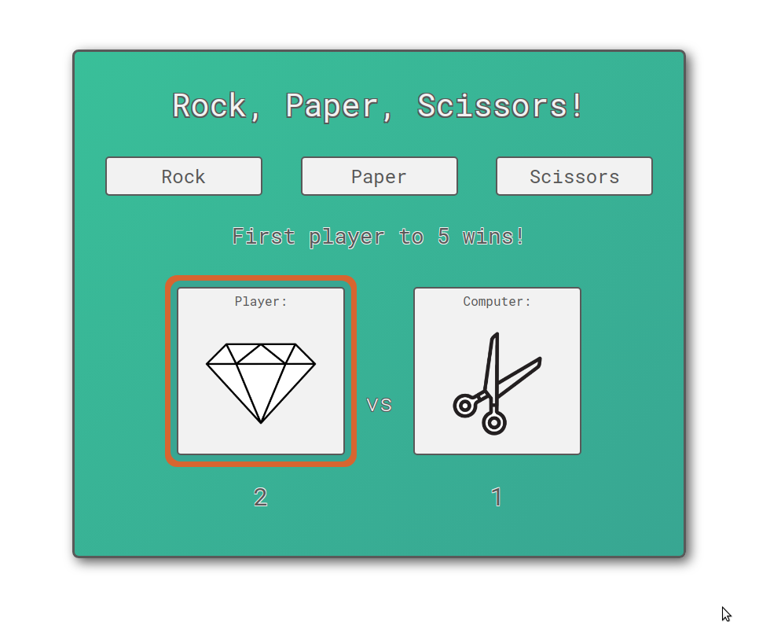
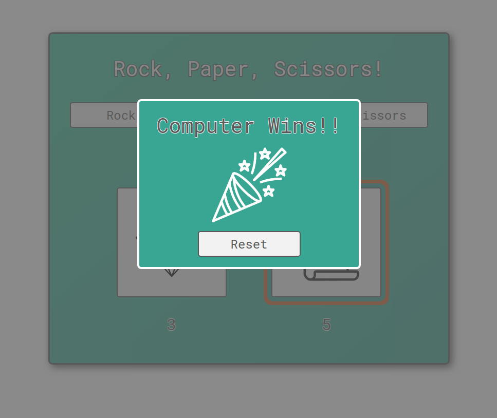

# **The Odin Project =>** *Rock Paper Scissors*

In this introductory *JavaScript* project, I created a browser version of the classic game *Rock, Paper, Scissors*.

---
The design is simple but I think lends itself to an easily played game, without excessive instruction.

I had a lot of difficulty writing this game and adding the UI to the original game created many issues which I struggled to overcome. But I am really pleased with the outcome and so far everything works as I hoped!

Please give it a go:  [Play Me!](https://capetownkimmy.github.io/rock-paper-scissors/)

---

Thanks for reading.

---

## Software & Skills: ##
* HTML
* CSS
* JavaScript
* Figma
* Git
* GitHub
